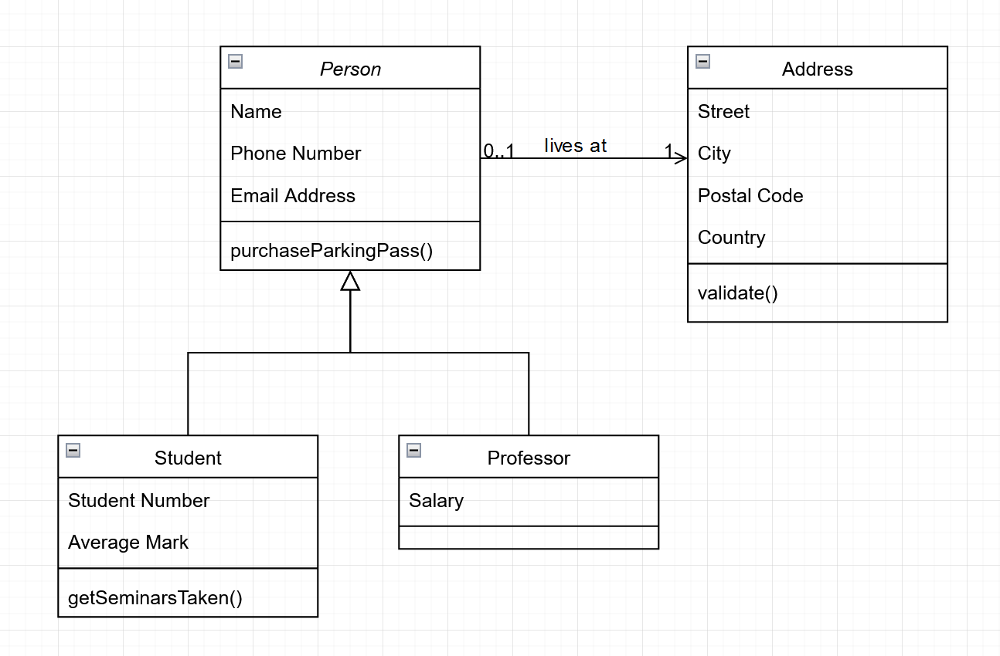

# SE3 Bonusaufgabe
# Teil 1
## Architekturkonzepte

**Kontextsicht**
- Blackbox
- Zeigen den Zusammenhang des Systems mit seiner Umgebung aus der Vogelperspektive
- Schnittstellen nach außen
- Interaktion mit wichtigen Stakeholdern
- Notation z.B. durch Use Cases

**Bausteinsicht**
- Statische Struktur der Architekturbausteine des Systems, Subsysteme, Komponenten und deren Schnittstellen zueinander
- Notation z.B. durch UML-Klassendiagramme
  

**Laufzeitsicht**
- Beschreibt das Zusammenwirken der Bausteine zur Laufzeit
- Dynamische Strukturen
- Notation z.B. durch UML-Sequenz, Aktivitäts- oder Kollaborations/Kommunikationsdiagramme
  

**Verteilungssicht**
- Infrastruktursicht
- Beschreibung der Hardwarekomponenten (Rechner,Prozessoren, Netztopologien)
- System aus Betreibersicht
- Notation z.B. durch UML-Einsatzdiagramme

## Physische Verteilung

| Architektur | Pro | Kontra |
| ------------------------ | --- | ------ |
| Zweischichtenarchitektur | Einfachheit, Performance     | Skalierbarkeit, Wartungsfreundlichkeit, Flexibilität   | 
| Dreischichtenarchitektur | Skalierbarkeit, Wartungsfreundlichkeit, Flexibilität | Komplexität, Performance |
| Mehrschichtenarchitektur | wie Dreischichten + Plattform unabhängig | wie Dreischichten + mehr Komplexiteat |

# Teil 2
## Entrypoints
Aufgabe a) kann über die Klassen `CallbackClient` und `PollingClient` ausgeführt werden.
Aufgabe b) wird über die Klasse `BMIClient` ausgeführt.